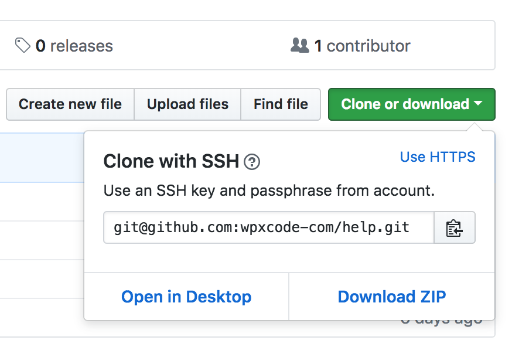

# Integrate addon with GitHub

If you want to add your personal repository to wpxcode.com copy the link from git hosting service for examle github like it is in the image bellow.
After you managed to copy URL paste it in addon details page at section "Git Integration"

